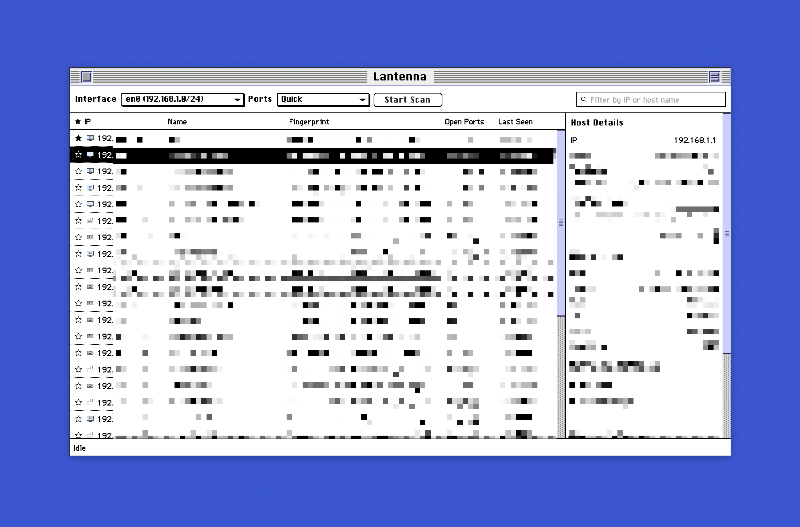

# Lantenna

Lantenna is a Tauri-based Mac OS X program that scans the local LAN and displays discovered hosts, host names, and open ports.



## Installation

```bash
# Clone the repository
cd Lantenna

# Install dependencies
npm install

# Run in development mode
npm run tauri dev

# Build for production
npm run tauri build
```

The built program will be in `src-tauri/target/release/bundle/dmg/`