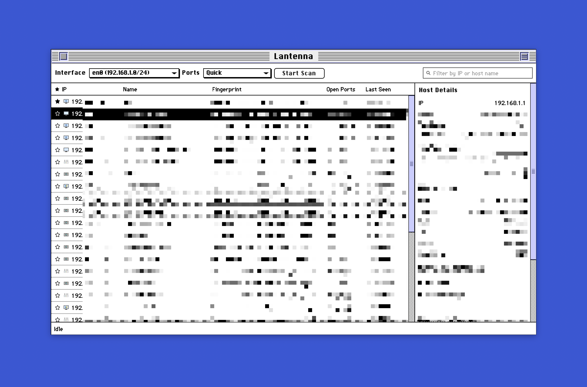

# Lantenna

Lantenna is a Tauri-based program for macOS and Linux that scans the local LAN and displays discovered hosts, host names, and open ports.

**Latest release:** v<!-- version -->1.0.1<!-- /version --> · [Download](https://github.com/L-K-M/Lantenna/releases/latest)



> [!IMPORTANT]
> LLM Disclosure: This project was developed with the assistance of large language models (AI coding tools).

## Platform support

The release workflow builds Lantenna for:

- macOS on Apple Silicon (`aarch64-apple-darwin`), as a `.dmg`
- macOS on Intel (`x86_64-apple-darwin`), as a `.dmg`
- Linux on x86_64 (`x86_64-unknown-linux-gnu`), as a `.deb` and an `.AppImage`

The Linux packages are built on Ubuntu 22.04, so they run on Ubuntu 22.04 and
later; the `.deb` targets Debian-family distributions, and the `.AppImage` should
work on any distribution with a comparable glibc. Lantenna is not released for
Windows.

## Install a release

On macOS, download the `.dmg` for your Mac's architecture from the
[latest release](https://github.com/L-K-M/Lantenna/releases/latest) and copy
Lantenna to your Applications folder.

On Ubuntu (and other Debian-family distributions), download the `.deb` and
install it (double-click it, or run
`sudo apt install ./Lantenna_<version>_amd64.deb`), **or** download the
`.AppImage`, mark it executable (`chmod +x`), and run it directly.

Lantenna discovers hosts by shelling out to `ping` and reading the kernel's
neighbour table with `ip neigh`, so the `.deb` depends on `iputils-ping` and
`iproute2`. It falls back to `arp` for systems that still ship it; `net-tools`
is deliberately not a dependency, since `iproute2` is present on every
Debian-family install and the fallback is there for other Unixes.

## Installation

Install Node.js, npm, and the stable Rust toolchain. On Ubuntu, also install the
Tauri v2 system prerequisites:

```bash
sudo apt install libwebkit2gtk-4.1-dev build-essential curl wget file \
  libxdo-dev libssl-dev libayatana-appindicator3-dev librsvg2-dev
```

Then run:

```bash
# Clone the repository
git clone https://github.com/L-K-M/Lantenna.git
cd Lantenna

# Install dependencies
npm install

# Run in development mode
npm run tauri dev

# Build for production
npm run tauri build
```

Bundles for the host architecture are written below
`src-tauri/target/release/bundle/` — a `.dmg` on macOS; a `.deb` and an
`.AppImage` on Linux.