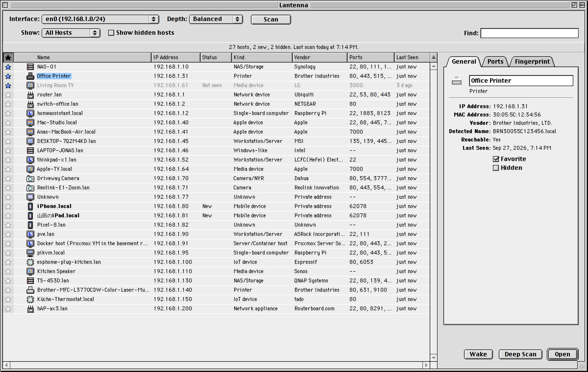

# Lantenna

> [!IMPORTANT]
> LLM disclosure: This codebase was written with substantial help from large language models: AI coding agents working from the [`AGENTS.md`](AGENTS.md) brief in this repo.

Lantenna is a Tauri-based program for macOS and Linux that scans the local LAN and displays discovered hosts, host names, and open ports.
It looks and works like a Mac OS 8.5 utility, drawn with [Osmium UI](https://github.com/L-K-M/osmium-ui).

**Latest release:** v<!-- version -->1.0.1<!-- /version --> · [Download](https://github.com/L-K-M/Lantenna/releases/latest)



## Using Lantenna

Choose an interface and a depth, then click **Scan**. The window header
says what the scan is doing; hosts appear in the list as they are found.
Select a host to see its addresses, ports and fingerprint in the Host
Information pane, and double-click it (or press Return) to open its web
page, file server, remote login or screen sharing.

- Every command is in the menu bar (on Linux, inside the window).
  Control-click or right-click a host, or empty space in the list, for a
  contextual menu.
- Keys (Control instead of Command on Linux): ⌘R Scan, ⌘. Stop, ⌘F Find,
  ⌘O Open, ⌘I Get Info, ⌘D Deep Scan, ⌘W Close Window. While the list
  has the keyboard, ⌘C copies the selected host's IP address and ⌘⌫
  (Control-Backspace on Linux) hides or shows it.
- Click a star to make a host a favorite; the Favorites menu jumps to it.
- Help > Show Balloons explains every control.
- View > as Icons shows the hosts as icons; View > Hide Host Information
  gives the list the whole window.

## Platform support

The release workflow builds Lantenna for:

- macOS on Apple Silicon (`aarch64-apple-darwin`), as a `.dmg`
- macOS on Intel (`x86_64-apple-darwin`), as a `.dmg`
- Linux on x86_64 (`x86_64-unknown-linux-gnu`), as a `.deb`, an `.AppImage`, and a `.flatpak`

The `.deb` and `.AppImage` are built on Ubuntu 22.04, so they run on Ubuntu 22.04
and later; the `.deb` targets Debian-family distributions, and the `.AppImage`
should work on any distribution with a comparable glibc. The `.flatpak` runs
against the GNOME runtime on any distribution with Flatpak, independent of the
build host. Lantenna is not released for
Windows.

## Install a release

On macOS, download the `.dmg` for your Mac's architecture from the
[latest release](https://github.com/L-K-M/Lantenna/releases/latest) and copy
Lantenna to your Applications folder.

On Ubuntu (and other Debian-family distributions), download the `.deb` and
install it (double-click it, or run
`sudo apt install ./Lantenna_<version>_amd64.deb`), **or** download the
`.AppImage`, mark it executable (`chmod +x`), and run it directly.

Lantenna discovers hosts by shelling out to `ping` and, on Linux, reading the
kernel's neighbour table with `ip neigh`, so the `.deb` depends on
`iputils-ping` and `iproute2`. If `ip` is missing it falls back to `arp`, which
is why `net-tools` is deliberately not a dependency: `iproute2` carries Debian's
`Priority: important`, so the fallback should never be needed on a
Debian-family system. (macOS reads the table with `arp` directly.)

## Installation

Install Node.js, npm, and the stable Rust toolchain. On Ubuntu, also install the
Tauri v2 system prerequisites:

```bash
sudo apt install libwebkit2gtk-4.1-dev build-essential curl wget file \
  libxdo-dev libssl-dev libayatana-appindicator3-dev librsvg2-dev
```

Then run:

```bash
# Clone the repository
git clone https://github.com/L-K-M/Lantenna.git
cd Lantenna

# Install dependencies
npm install

# Run in development mode
npm run tauri dev

# Build for production
npm run tauri build
```

Or let `scripts/build.sh` run the CI checks (svelte-check, vitest, cargo
fmt/clippy/test) and then build the host bundles for you;
`scripts/build.sh --install` also installs the result (`/Applications` on
macOS; the `.deb` via apt or the AppImage into `~/Applications` on Linux).

To work on the interface in a browser without the backend, run
`npm run dev -- --mode mock` and open
`http://localhost:1420/?scenario=scanning&platform=mac`: a mock backend
(`src/lib/dev/mockBackend.ts`) plays scripted scans. Scenarios include
`idle`, `first-run`, `scanning`, `fingerprint`, `stopping`, `error`,
`empty` and `many`; `platform=linux` shows the Linux layout.

Bundles for the host architecture are written below
`src-tauri/target/release/bundle/` — a `.dmg` on macOS; a `.deb` and an
`.AppImage` on Linux.